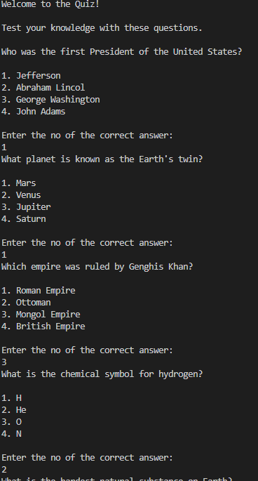
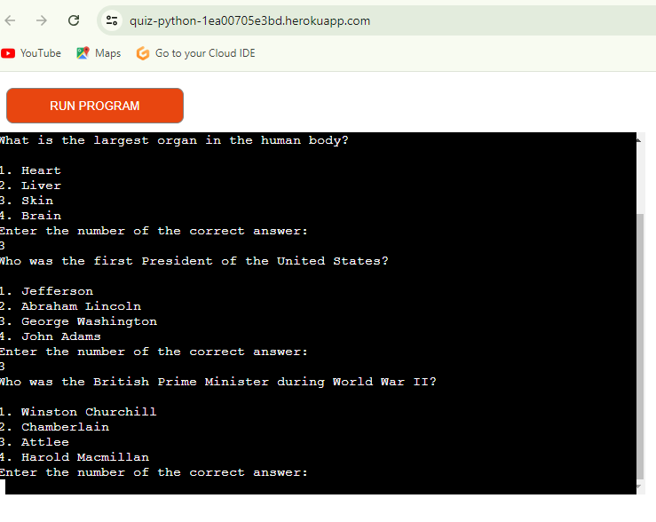

Quiz Application

Contents

•	Introduction

•	Project

o	User goals:

o	Site owner goals

•	Pre development

•	Development

•	Features

o	Slow Typing Instructions

o	Name and profession input

o	Confirm information so far 

o	What the portal checks

o	Error Page

•	Technologies Used

•	Resources

o	Libraries

•	Testing

•	Future Updates

•	Validation
 
•	Deployment

o	Heroku

o	Branching the GitHub Repository using GitHub Desktop and Visual Studio Code

•	Bugs

•	Credits

•	Acknowledgements

                                                                Quiz Application

        Introduction

Welcome to the Quiz Application! This is an interactive console-based quiz game written in Python. Designed to be both educational and entertaining, the quiz covers a variety of topics, including science, history, and general knowledge. Users are challenged with multiple-choice questions, and the application provides immediate feedback on their answers. 

Project
The project is designed to help users test their knowledge on various topics through a simple and interactive quiz interface.

 User Goals
•	Engage in Fun Learning: Users can participate in a quiz that tests their knowledge across different subjects. It offers a fun way to learn new facts and information.
•	Receive Instant Feedback: After answering each question, users receive immediate feedback, including their score and details about which answers were incorrect.
•	Track Progress: Users can see their overall performance and review incorrect answers to improve their knowledge.

 Site Owner Goals:
•	Deliver an Engaging Experience: Create an enjoyable and challenging quiz experience that keeps users interested and encourages them to learn more.
•	Ensure Smooth Operation: Develop a reliable application that functions correctly, handles user input effectively, and provides accurate feedback.
•	Gather User Feedback: Collect feedback from users to understand their experience and identify areas for improvement.

Pre-development
•	Conceptualization: Define the objective of the quiz application. Decide on the types of questions, topics covered, and the overall structure of the quiz. Ensure that the quiz aligns with educational or entertainment goals.

•	Design: Plan the user interaction flow. Determine how questions will be presented, how answers will be inputted, and how feedback will be provided. Sketch out the basic structure of the quiz, including how it will handle various inputs and scenarios.

•	Requirements: Identify the features and functionalities needed. This includes defining the types of questions, ensuring proper validation of user inputs, and creating mechanisms for tracking scores and providing feedback.
Development
•	Set Up the Environment: Initialize a Python development environment. Install any necessary libraries and set up version control using Git.

•	Implement Core Logic: Develop the Question class to represent quiz questions and their options. Create the run quiz function to handle the quiz flow, including shuffling questions, presenting options, and collecting user inputs.

•	Test and Refine: Perform thorough testing to ensure the application works as intended. Test with different types of inputs to handle edge cases and refine the code to improve functionality and user experience.
Features
•	Slow Typing Instructions: (Optional) Introduce a feature where instructions or text are displayed slowly, mimicking a typewriter effect to make the experience more engaging.
•	Name and Profession Input: (Optional) Allow users to input their name and profession to personalize the quiz experience and create a more engaging interaction.
•	Confirm Information: (Optional) Include a confirmation step where users can review their answers and choices before submitting them, adding an extra layer of interaction.
•	What the Portal Checks: Ensure the application checks if the user's selected answer matches the correct answer. The application should handle incorrect inputs gracefully and provide clear guidance for valid choices.
•	Error Page: (Optional) Implement an error handling mechanism to manage unexpected issues or invalid inputs. Provide a user-friendly error message to help users understand and correct their mistakes.
Technologies Used
•	Python: The primary programming language used to build the quiz application. Python provides a straightforward syntax and powerful libraries for handling various functionalities
•	Random Module: Utilized for shuffling the questions to ensure they appear in a random order each time the quiz is run..
 Resources
Libraries
•	random: Utilized for shuffling the list of questions to ensure a randomized and engaging quiz experience each time it is played.
Testing
•	Unit Tests: Conduct tests on individual components, such as the Question class and the run quiz function, to verify their correctness and reliability.
•	Integration Tests: Test the complete application to ensure that all components work together as expected. Check that the quiz runs smoothly from start to finish and handles various user inputs effectively.

Future Updates
•	Additional Questions: Plan to expand the quiz with a broader range of questions covering more topics and increasing the challenge for users.
 
User Interface (UI): Consider developing a graphical user interface (GUI) for a more interactive and visually appealing quiz experience, beyond the console-based interaction.

 

Leaderboard: Implement a leaderboard feature to track high scores and encourage users to compete and improve their quiz performance.
  

 

Validation
•	Input Validation: Ensure that user inputs are validated to prevent errors. Handle invalid inputs gracefully and prompt users to enter valid responses.

•	Answer Checking: Confirm that the application accurately checks user answers against the correct answers and provides appropriate feedback.

Deployment
•	Heroku: (Optional) Deploy the application to Heroku or another cloud platform to make it accessible online. This allows users to access the quiz from any web browser.

 

Branching the GitHub Repository Using GitHub Desktop and Visual Studio Code
•	GitHub Desktop: Used for managing branches and handling commits to the repository.

•	Visual Studio Code: Employed for coding, managing project files, and handling version control.

Bugs
•	Known Issues: Document any known bugs or issues within the application. Provide details on how they impact the functionality and any potential workarounds.
•	Troubleshooting: Offer guidance on common issues users might encounter and provide solutions to help resolve them.
 Credits
- The initial set of questions were created by the project developer.

Acknowledgements
- Thanks to the Python community for providing excellent resources and documentation. And My Mentor.
This README provides a comprehensive overview of the project and should help users and developers understand the purpose, functionality, and future direction of the quiz application.
